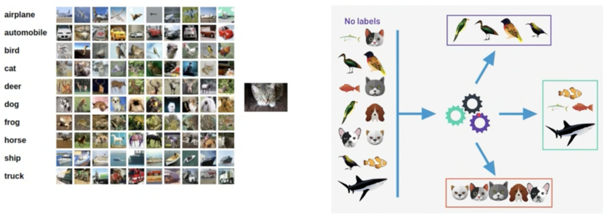

# Supervised learning vs Unsupervised learning

Supervised learning: (예시, 라벨) 형태의 데이터가 주어진다. 훈련이 완료되면, 모델은 **보지 않은(Unseen)** 예시에 대한 라벨을 예측한다.

Unsupervised learning: 라벨이 붙지 않은 여러 예시가 주어진다. 모델은 데이터 샘플로부터 특정 패턴을 학습한다.

