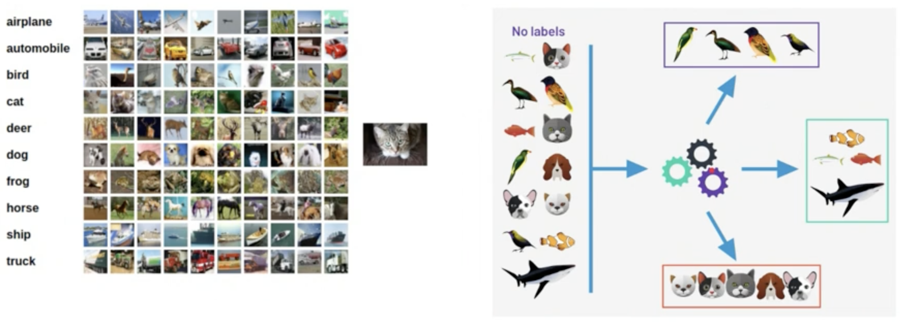
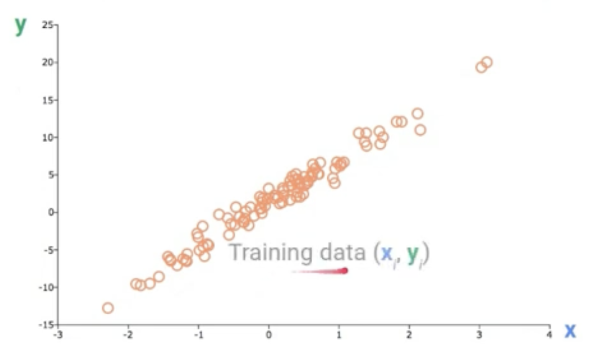

# Supervised learning vs Unsupervised learning

**Supervised learning**
(예시, 라벨) 형태의 데이터가 주어진다. 훈련이 완료되면, 모델은 **보지 않은(Unseen)** 예시에 대한 라벨을 예측한다.

**Unsupervised learning**
라벨이 붙지 않은 여러 예시가 주어진다. 모델은 데이터 샘플로부터 특정 패턴을 학습한다.

# Supervised Learning Framework

Machine learning is data-driven approach.

- Step1. 모델의 형태를 디자인한다 (e.g., f(x) = ax, 선형적인 관계를 가질 것임).
- Step2. 모델의 목표를 정의한다 (e.g., f(x)와 y가 최대한 비슷하도록 함)
- Step3. 학습 데이터로 목표를 가장 잘 달성하는 a (파라미터)를 찾는다.
- Step4. 보지않은 x를 주고, 라벨을 예측하도록 할 수 있다.

